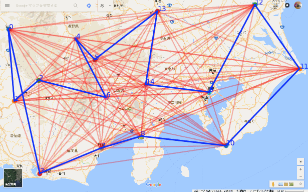
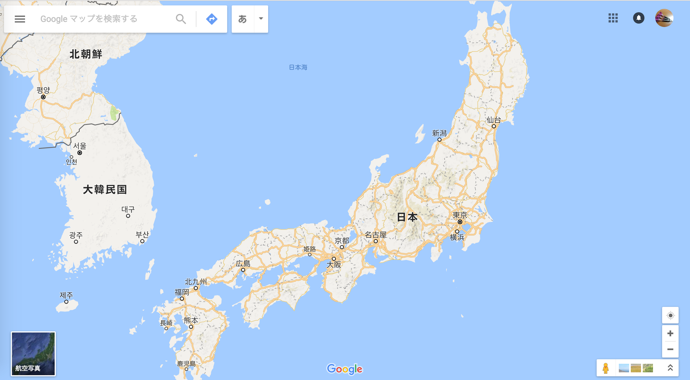

# AntColonyOptimization
## Description
AntColonyOptimization(蟻コロニー最適化)とは、
組み合わせ最適化の確率的アルゴリズムである。  
メタヒューリスティクス手法群の１つ。  


## Environment
### Python version
Python 3.6.3 :: Anaconda, Inc.

### Requirements
```requirements.txt
certifi==2017.11.5
cycler==0.10.0
matplotlib==2.1.1
numpy==1.13.3
olefile==0.44
Pillow==4.3.0
pyparsing==2.2.0
python-dateutil==2.6.1
pytz==2017.3
PyYAML==3.12
six==1.11.0
```

## 実行
### デモまで
1. リポジトリクローン

    `git clone bruichladdich`

1. モジュールインストール

    `pip install -r requirements.txt`

1. デモの実行

    ```
    cd controllers

    # 数値演算スクリプト
    python antColony.py

    # 可視化スクリプト
    python antVisualizer.py
    ```

### サンプルデータの作りかた
背景画像差し替えや、探索するノードの設定方法。
1. 新しい画像を用意する。
    ここでは例として、google_map_japan.pngを用意し、`data/` に配置する。
    

1. `tasks/create_dataset.py` の2つのパラメータを書き変える。
    `img_path` : 新しく用意した画像へのパス.
    `save_path` : 画像をプロットすることで入力した座標データのpickle保存パス.

1. 座標の入力
    `create_dataset.py` を実行すると、新しく用意した画像が `matplotlib.pyplot` によって表示される。
    画像の任意の箇所をクリックすることで、その地点をノードに追加出来る。  
    TODO: 大変残変なことに、クリックしてもリアクションはない。本当は赤いドットみたいなのをプロットしたい。

1. `controllers/antVisualizer.py` の2つのパラメータを書き換える。
    `which_dataset` : どのデータセットpickleを使うか。ここでは上記 `create_dataset.py` の `save_path` に対応する。
    `base_img_path`: 背景画像までのパス。 ここでは上記 `create_dataset.py` の `img_path` に対応する。

## Author
宮川 健吾 - k.miyakawa@9dw
